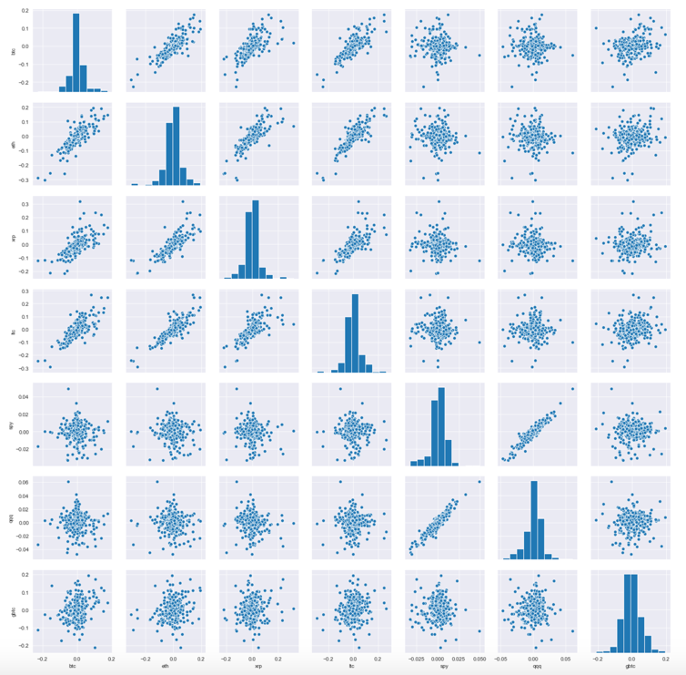
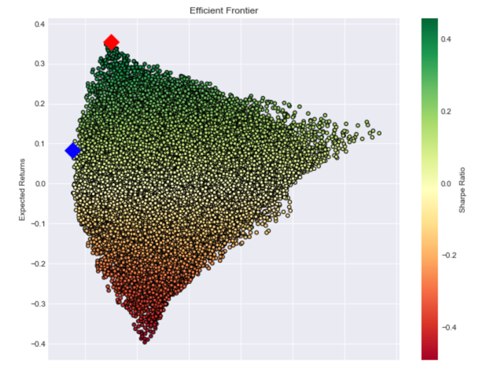
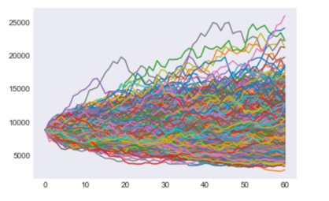
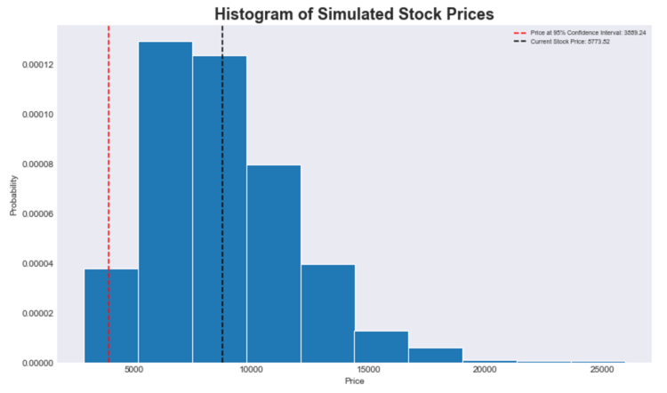
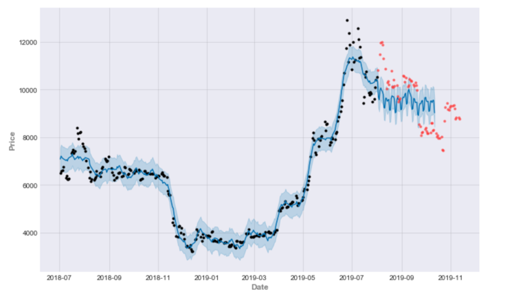

Exploratory Crypto Analysis
---------------------

About
------------

This repository contains jupyter notebooks exploring crypto asset pricing as well as 
portfolio modeling. We look at crypto asset correlations, value at risk, efficient frontier,
and time series forecasting with Facebook's Prophet model.

Crypto Returns Correlations
------------
Most Crypto assets are strongly correlated to one another, yet poorly correlated to the equity market.



Crypto Portfolio
------------

We simulate portfolios and their returns using historical price distributions of bitcoin, ethereum, ripple, 
and litecoin to find the maximum sharpe portfolio and minimum variance portfolio from the efficient frontier.



Maximum Sharpe Portfolio:
```
Returns  | Volatility | Sharpe Ratio | btc Weight | eth Weight | xrp Weight | ltc Weight
0.355384 | 0.775343   | 0.458358     | 0.928196	  | 0.0065     | 0.003147   | 0.062157
```

Minimum Variance Portfolio:
```
Returns  | Volatility | Sharpe Ratio | btc Weight | eth Weight | xrp Weight | ltc Weight
0.083528 | 0.737856   | 0.113204     | 0.636805   | 0.009759   | 0.352479   | 0.000958
```

Bitcoin Value at Risk
------------

Monte Carlo simulate from BTC historical price distributions to calculate the VaR at different
levels.  
    
60 day price simulation:    



60 day Value at Risk:
```
VaR at 90% Confidence: $3,398.19
VaR at 95% Confidence: $3,950.89
VaR at 99% Confidence: $5,034.03
VaR at 99.99% Confidence: $6,169.21
```


Bitcoin Time Series Forecast
------------
Forecast BTC price with 1 year of historical prices using facebook prophet and a monthly cycle.


```
Projected return per cycle: 323.88
MSE:  995303.4063
MAE:  800.9209
R2:   0.1833
MSLE: 0.0106
MAE:  800.9209
```